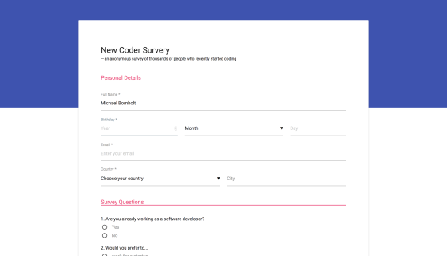

# freeCodeCamp

This repository contains my solved [freeCodeCamp](https://www.freecodecamp.org) projects and challenges that are required for certification.

&nbsp;

## Table of Contents

### freeCodeCamp Certifications

- [x] [**Responsive Web Design**](https://github.com/b0mh0lt/freeCodeCamp#responsive-web-design)
- [x] [**JavaScript Algorithms and Data Structures**](https://github.com/b0mh0lt/freeCodeCamp#javascript-algorithms-and-data-structures)
- [ ] [Front End Libraries](https://github.com/b0mh0lt/freeCodeCamp#front-end-libraries)
- [ ] [Data Visualization](https://github.com/b0mh0lt/freeCodeCamp#data-visualization)
- [ ] API and Microservices
- [ ] Information Security and Quality Assurance

### Legacy Certifications

- [x] [**Legacy Front End Development**](https://github.com/b0mh0lt/freeCodeCamp#legacy-front-end-development)
- [ ] _~~Legacy Data Visualization~~_
- [ ] _~~Legacy Back End Development~~_

&nbsp;

## Responsive Web Design

- [**Build a Tribute Page**](https://b0mh0lt.github.io/freeCodeCamp/legacy_front_end_development/tribute_page)

  

- [**Build a Survey Form**](https://b0mh0lt.github.io/freeCodeCamp/responsive_web_design/survey_form)

  

- [**Build A Product Landing Page**](https://b0mh0lt.github.io/freeCodeCamp/responsive_web_design/landing_page)

  

- [**Build a Technical Documentation Page**](https://b0mh0lt.github.io/freeCodeCamp/responsive_web_design/documentation_page)

  

- [**Build a Personal Portfolio Webpage**](https://b0mh0lt.github.io/freeCodeCamp/legacy_front_end_development/personal_portfolio)

  

&nbsp;

## JavaScript Algorithms and Data Structures

### Basic Algorithm Scripting

- [**Convert Celsius to Fahrenheit**](https://github.com/b0mh0lt/freeCodeCamp/tree/master/js_algorithms_and_data_structures/basic_algorithm_scripting/convert_celsius_to_fahrenheit.js)
- [**Reverse a String**](https://github.com/b0mh0lt/freeCodeCamp/tree/master/js_algorithms_and_data_structures/basic_algorithm_scripting/reverse_a_string.js)
- [**Factorialize a Number**](https://github.com/b0mh0lt/freeCodeCamp/tree/master/js_algorithms_and_data_structures/basic_algorithm_scripting/factorialize_a_number.js)
- [**Find the Longest Word in a String**](https://github.com/b0mh0lt/freeCodeCamp/tree/master/js_algorithms_and_data_structures/basic_algorithm_scripting/find_the_longest_word_in_a_string.js)
- [**Return Largest Numbers in Arrays**](https://github.com/b0mh0lt/freeCodeCamp/tree/master/js_algorithms_and_data_structures/basic_algorithm_scripting/return_largest_numbers_in_arrays.js)
- [**Confirm the Ending**](https://github.com/b0mh0lt/freeCodeCamp/tree/master/js_algorithms_and_data_structures/basic_algorithm_scripting/confirm_the_ending.js)
- [**Repeat a String Repeat a String**](https://github.com/b0mh0lt/freeCodeCamp/tree/master/js_algorithms_and_data_structures/basic_algorithm_scripting/repeat_a_string_repeat_a_string.js)
- [**Truncate a String**](https://github.com/b0mh0lt/freeCodeCamp/tree/master/js_algorithms_and_data_structures/basic_algorithm_scripting/truncate_a_string.js)
- [**Finders Keepers**](https://github.com/b0mh0lt/freeCodeCamp/tree/master/js_algorithms_and_data_structures/basic_algorithm_scripting/finders_keepers.js)
- [**Boo who**](https://github.com/b0mh0lt/freeCodeCamp/tree/master/js_algorithms_and_data_structures/basic_algorithm_scripting/boo_who.js)
- [**Title Case a Sentence**](https://github.com/b0mh0lt/freeCodeCamp/tree/master/js_algorithms_and_data_structures/basic_algorithm_scripting/title_case_a_sentence.js)
- [**Slice and Splice**](https://github.com/b0mh0lt/freeCodeCamp/tree/master/js_algorithms_and_data_structures/basic_algorithm_scripting/slice_and_splice.js)
- [**Falsy Bouncer**](https://github.com/b0mh0lt/freeCodeCamp/tree/master/js_algorithms_and_data_structures/basic_algorithm_scripting/falsy_bouncer.js)
- [**Where do I Belong**](https://github.com/b0mh0lt/freeCodeCamp/tree/master/js_algorithms_and_data_structures/basic_algorithm_scripting/where_do_i_belong.js)
- [**Mutations**](https://github.com/b0mh0lt/freeCodeCamp/tree/master/js_algorithms_and_data_structures/basic_algorithm_scripting/mutations.js)
- [**Chunky Monkey**](https://github.com/b0mh0lt/freeCodeCamp/tree/master/js_algorithms_and_data_structures/basic_algorithm_scripting/chunky_monkey.js)

### Intermediate Algorithm Scripting

- [**Sum All Numbers in a Range**](https://github.com/b0mh0lt/freeCodeCamp/tree/master/js_algorithms_and_data_structures/intermediate_algorithm_scripting/sum_all_numbers_in_a_range.js)
- [**Diff Two Arrays**](https://github.com/b0mh0lt/freeCodeCamp/tree/master/js_algorithms_and_data_structures/intermediate_algorithm_scripting/diff_two_arrays.js)
- [**Seek and Destroy**](https://github.com/b0mh0lt/freeCodeCamp/tree/master/js_algorithms_and_data_structures/intermediate_algorithm_scripting/seek_and_destroy.js)
- [**Wherefore art thou**](https://github.com/b0mh0lt/freeCodeCamp/tree/master/js_algorithms_and_data_structures/intermediate_algorithm_scripting/wherefore_art_thou.js)
- [**Spinal Tap Case**](https://github.com/b0mh0lt/freeCodeCamp/tree/master/js_algorithms_and_data_structures/intermediate_algorithm_scripting/spinal_tap_case.js)
- [**Pig Latin**](https://github.com/b0mh0lt/freeCodeCamp/tree/master/js_algorithms_and_data_structures/intermediate_algorithm_scripting/pig_latin.js)
- [**Search and Replace**](https://github.com/b0mh0lt/freeCodeCamp/tree/master/js_algorithms_and_data_structures/intermediate_algorithm_scripting/search_and_replace.js)
- [**DNA Pairing**](https://github.com/b0mh0lt/freeCodeCamp/tree/master/js_algorithms_and_data_structures/intermediate_algorithm_scripting/dna_pairing.js)
- [**Missing letters**](https://github.com/b0mh0lt/freeCodeCamp/tree/master/js_algorithms_and_data_structures/intermediate_algorithm_scripting/missing_letters.js)
- [**Sorted Union**](https://github.com/b0mh0lt/freeCodeCamp/tree/master/js_algorithms_and_data_structures/intermediate_algorithm_scripting/sorted_union.js)
- [**Convert HTML Entities**](https://github.com/b0mh0lt/freeCodeCamp/tree/master/js_algorithms_and_data_structures/intermediate_algorithm_scripting/convert_html_entities.js)
- [**Sum All Odd Fibonacci Numbers**](https://github.com/b0mh0lt/freeCodeCamp/tree/master/js_algorithms_and_data_structures/intermediate_algorithm_scripting/sum_all_odd_fibonacci_numbers.js)
- [**Sum All Primes**](https://github.com/b0mh0lt/freeCodeCamp/tree/master/js_algorithms_and_data_structures/intermediate_algorithm_scripting/sum_all_primes.js)
- [**Smallest Common Multiple**](https://github.com/b0mh0lt/freeCodeCamp/tree/master/js_algorithms_and_data_structures/intermediate_algorithm_scripting/smallest_common_multiple.js)
- [**Drop it**](https://github.com/b0mh0lt/freeCodeCamp/tree/master/js_algorithms_and_data_structures/intermediate_algorithm_scripting/drop_it.js)
- [**Steamroller**](https://github.com/b0mh0lt/freeCodeCamp/tree/master/js_algorithms_and_data_structures/intermediate_algorithm_scripting/steamroller.js)
- [**Binary Agents**](https://github.com/b0mh0lt/freeCodeCamp/tree/master/js_algorithms_and_data_structures/intermediate_algorithm_scripting/binary_agents.js)
- [**Everything Be True**](https://github.com/b0mh0lt/freeCodeCamp/tree/master/js_algorithms_and_data_structures/intermediate_algorithm_scripting/everything_be_true.js)
- [**Arguments Optional**](https://github.com/b0mh0lt/freeCodeCamp/tree/master/js_algorithms_and_data_structures/intermediate_algorithm_scripting/arguments_optional.js)
- [**Make a Person**](https://github.com/b0mh0lt/freeCodeCamp/tree/master/js_algorithms_and_data_structures/intermediate_algorithm_scripting/make_a_person.js)
- [**Map the Debris**](https://github.com/b0mh0lt/freeCodeCamp/tree/master/js_algorithms_and_data_structures/intermediate_algorithm_scripting/map_the_debris.js)

### Advanced Algorithm Scripting

- [**Palindrome Checker**](https://github.com/b0mh0lt/freeCodeCamp/tree/master/js_algorithms_and_data_structures/advanced_algorithm_scripting/palindrome_checker.js)
- [**Roman Numeral Converter**](https://github.com/b0mh0lt/freeCodeCamp/tree/master/js_algorithms_and_data_structures/advanced_algorithm_scripting/roman_numeral_converter.js)
- [**Caesars Cipher**](https://github.com/b0mh0lt/freeCodeCamp/tree/master/js_algorithms_and_data_structures/advanced_algorithm_scripting/caesars_cipher.js)
- [**Telephone Number Validator**](https://github.com/b0mh0lt/freeCodeCamp/tree/master/js_algorithms_and_data_structures/advanced_algorithm_scripting/telephone_number_validator.js)
- [**Cash Register**](https://github.com/b0mh0lt/freeCodeCamp/tree/master/js_algorithms_and_data_structures/advanced_algorithm_scripting/cash_register.js)

&nbsp;

## Front End Libraries

- [**Build a Random Quote Machine**](https://b0mh0lt.github.io/freeCodeCamp/legacy_front_end_development/random_quote_machine)

  

- [**Build A Markdown Previewer**](https://b0mh0lt.github.io/freeCodeCamp/front_end_libraries/markdown_previewer)

  

- Build A Drum Machine

- [**Build a JavaScript Calculator**](https://b0mh0lt.github.io/freeCodeCamp/legacy_front_end_development/js_calculator)

  

- [**Build a Pomodoro Clock**](https://b0mh0lt.github.io/freeCodeCamp/legacy_front_end_development/pomodoro_clock)

  

&nbsp;

## Data Visualization

- [**Visualize Data with a Bar Chart**](https://b0mh0lt.github.io/freeCodeCamp/data_visualization/bar_chart)

  

- [**Visualize Data with a Scatterplot Graph**](https://b0mh0lt.github.io/freeCodeCamp/data_visualization/scatter_plot)

  

- [**Visualize Data with a Heat Map**](https://b0mh0lt.github.io/freeCodeCamp/data_visualization/heat_map)

  

- Visualize Data with a Choropleth Map

- Visualize Data with a Treemap Diagram

&nbsp;

## Legacy Front End Development

- [**Build a Tribute Page**](https://b0mh0lt.github.io/freeCodeCamp/legacy_front_end_development/tribute_page)

  

- [**Build a Personal Portfolio Webpage**](https://b0mh0lt.github.io/freeCodeCamp/legacy_front_end_development/personal_portfolio)

  

- [**Build a Random Quote Machine**](https://b0mh0lt.github.io/freeCodeCamp/legacy_front_end_development/random_quote_machine)

  

- [**Show the Local Weather**](https://b0mh0lt.github.io/freeCodeCamp/legacy_front_end_development/local_weather)

  

- [**Build a Wikipedia Viewer**](https://b0mh0lt.github.io/freeCodeCamp/legacy_front_end_development/wikipedia_viewer)

  

- [**Use the Twitch.tv JSON API**](https://b0mh0lt.github.io/freeCodeCamp/legacy_front_end_development/twitch_status)

  

- [**Build a JavaScript Calculator**](https://b0mh0lt.github.io/freeCodeCamp/legacy_front_end_development/js_calculator)

  

- [**Build a Pomodoro Clock**](https://b0mh0lt.github.io/freeCodeCamp/legacy_front_end_development/pomodoro_clock)

  

- [**Build a Tic Tac Toe Game**](https://b0mh0lt.github.io/freeCodeCamp/legacy_front_end_development/tic_tac_toe)

  

- [**Build a Simon Game**](https://b0mh0lt.github.io/freeCodeCamp/legacy_front_end_development/simon_game)

  
