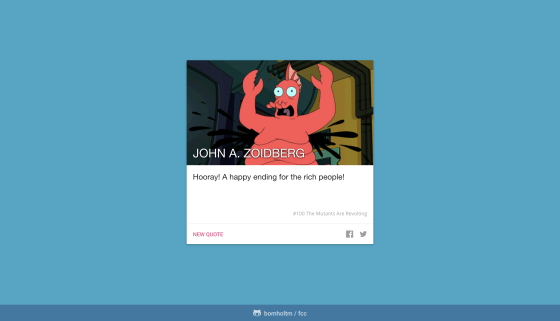

# freeCodeCamp

:warning: This repository is currently being restructured! :warning:

&nbsp;

## Curriculum

- [x] [**Responsive Web Design**](https://github.com/b0mh0lt/freeCodeCamp#responsive-web-design) **(5/5)**
- [x] [JavaScript Algorithms and Data Structures](https://github.com/b0mh0lt/freeCodeCamp/tree/master/js_algorithms_and_data_structures) (5/5)
  - [x] [Basic Algorithm Scripting](https://github.com/b0mh0lt/freeCodeCamp/tree/master/js_algorithms_and_data_structures/basic_algorithm_scripting) (16/16)
  - [x] [Intermediate Algorithm Scripting](https://github.com/b0mh0lt/freeCodeCamp/tree/master/js_algorithms_and_data_structures/intermediate_algorithm_scripting) (21/21)
- [ ] [**Front End Libraries**](https://github.com/b0mh0lt/freeCodeCamp#front-end-libraries) **(4/5)**
- [ ] [**Data Visualization**](https://github.com/b0mh0lt/freeCodeCamp#data-visualization) **(3/5)**
- [ ] **API and Microservices (0/5)**
- [ ] **Quality Assurance (0/5)**
- [ ] **Scientific Computing with Python (0/5)**
- [ ] **Data Analysis with Python (0/5)**
- [ ] **Information Security (0/5)**
- [ ] **Machine Learning with Python (0/5)**
- [ ] Coding Interview Prep
  - [ ] [Algorithms](https://github.com/b0mh0lt/freeCodeCamp/tree/master/coding_interview_prep/algorithms) (4/9)
  - [ ] Data Structures (0/46)
  - [ ] [**Take Home Projects**](https://github.com/b0mh0lt/freeCodeCamp#take-home-projects) **(5/20)**
  - [ ] Rosetta Code (0/160)
  - [ ] Project Euler (2/480)

&nbsp;

## Responsive Web Design

- [**Build a Tribute Page**](https://b0mh0lt.github.io/freeCodeCamp/responsive_web_design/tribute_page)

  

- [**Build a Survey Form**](https://b0mh0lt.github.io/freeCodeCamp/responsive_web_design/survey_form)

  

- [**Build a Product Landing Page**](https://b0mh0lt.github.io/freeCodeCamp/responsive_web_design/landing_page)

  

- [**Build a Technical Documentation Page**](https://b0mh0lt.github.io/freeCodeCamp/responsive_web_design/documentation_page)

  

- [**Build a Personal Portfolio Webpage**](https://b0mh0lt.github.io/freeCodeCamp/responsive_web_design/personal_portfolio)

  

&nbsp;

## Front End Libraries

- [**Build a Random Quote Machine**](https://b0mh0lt.github.io/freeCodeCamp/front_end_libraries/random_quote_machine)

  

- [**Build a Markdown Previewer**](https://b0mh0lt.github.io/freeCodeCamp/front_end_libraries/markdown_previewer)

  

- Build a Drum Machine

- [**Build a JavaScript Calculator**](https://b0mh0lt.github.io/freeCodeCamp/front_end_libraries/js_calculator)

  

- [**Build a 25 + 5 Clock**](https://b0mh0lt.github.io/freeCodeCamp/front_end_libraries/25_5_clock)

  

&nbsp;

## Data Visualization

- [**Visualize Data with a Bar Chart**](https://b0mh0lt.github.io/freeCodeCamp/data_visualization/bar_chart)

  

- [**Visualize Data with a Scatterplot Graph**](https://b0mh0lt.github.io/freeCodeCamp/data_visualization/scatter_plot)

  

- [**Visualize Data with a Heat Map**](https://b0mh0lt.github.io/freeCodeCamp/data_visualization/heat_map)

  

- Visualize Data with a Choropleth Map

- Visualize Data with a Treemap Diagram

&nbsp;

## Take Home Projects

- [**Show the Local Weather**](https://b0mh0lt.github.io/freeCodeCamp/coding_interview_prep/local_weather)

  
