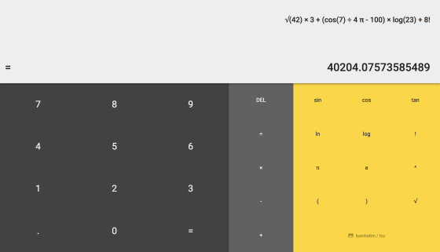
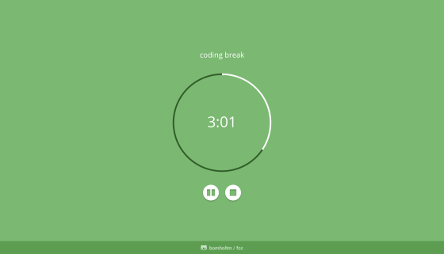

## Front End Libraries

###### :warning: Please note:

_"Build a Random Quote Machine"_, _"Build a JavaScript Calculator"_ & _"Build a Pomodoro Clock"_ were originally solved as part of the Legacy Front End Development Certification. The user stories may have changed, `code` can be found [here](https://github.com/bomholtm/fcc/tree/master/legacy_front_end_development).

- [**Build a Random Quote Machine**](https://bomholtm.github.io/fcc/legacy_front_end_development/random_quote_machine)

  

  _#html, #css, #sass, #javascript, #jquery, #zurb-foundation_

- [**Build A Markdown Previewer**](https://bomholtm.github.io/fcc/front_end_libraries/markdown_previewer)

  

  _#html, #css, #javascript, #babel, #reactjs_

- Build A Drum Machine

- [**Build a JavaScript Calculator**](https://bomholtm.github.io/fcc/legacy_front_end_development/js_calculator)

  

  _#html, #css, #sass, #javascript, #bootstrap_

- [**Build a Pomodoro Clock**](https://bomholtm.github.io/fcc/legacy_front_end_development/pomodoro_clock)

  

  _#html, #css, #sass, #javascript, #jquery, #zurb-foundation_
