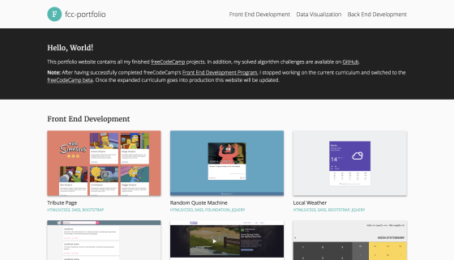
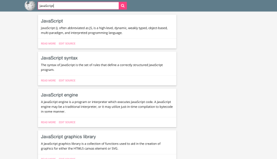
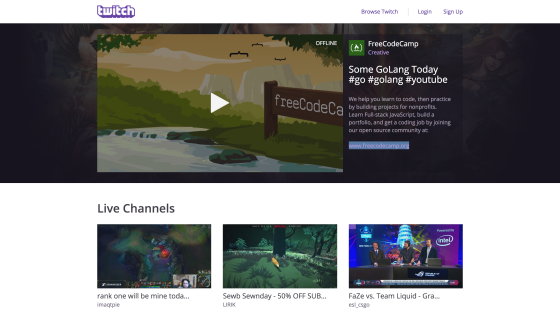
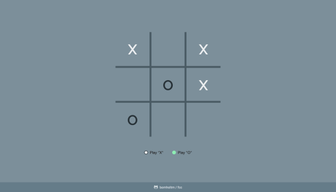
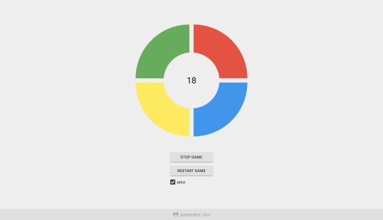

## Legacy Front End Development

- [**Build a Tribute Page**](https://bomholtm.github.io/fcc/legacy_front_end_development/tribute_page)

  

  _#html, #css, #sass, #bootstrap_

- [**Build a Personal Portfolio Webpage**](https://bomholtm.github.io/fcc/legacy_front_end_development/personal_portfolio)

  

  _#html, #css, #sass, #javascript, #jquery, #bootstrap_

- [**Build a Random Quote Machine**](https://bomholtm.github.io/fcc/legacy_front_end_development/random_quote_machine)

  

  _#html, #css, #sass, #javascript, #jquery, #zurb-foundation_

- [**Show the Local Weather**](https://bomholtm.github.io/fcc/legacy_front_end_development/local_weather)

  

  _#html, #css, #sass, #javascript, #jquery, #bootstrap_

- [**Build a Wikipedia Viewer**](https://bomholtm.github.io/fcc/legacy_front_end_development/wikipedia_viewer)

  

  _#html, #css, #sass, #javascript, #jquery, #zurb-foundation_

- [**Use the Twitch.tv JSON API**](https://bomholtm.github.io/fcc/legacy_front_end_development/twitch_status)

  

  _#html, #css, #sass, #javascript, #jquery, #bootstrap_

- [**Build a JavaScript Calculator**](https://bomholtm.github.io/fcc/legacy_front_end_development/js_calculator)

  

  _#html, #css, #sass, #javascript, #bootstrap_

- [**Build a Pomodoro Clock**](https://bomholtm.github.io/fcc/legacy_front_end_development/pomodoro_clock)

  

  _#html, #css, #sass, #javascript, #jquery, #zurb-foundation_

- [**Build a Tic Tac Toe Game**](https://bomholtm.github.io/fcc/legacy_front_end_development/tic_tac_toe)

  

  _#html, #css, #sass, #javascript, #jquery, #bootstrap_

- [**Build a Simon Game**](https://bomholtm.github.io/fcc/legacy_front_end_development/simon_game)

  

  _#html, #css, #sass, #javascript, #jquery_
